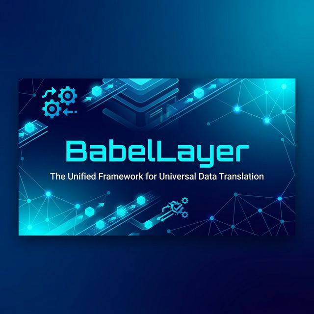

# 🌐 BabelLayer

[](https://opensource.org/licenses/MIT)
[](https://www.python.org/downloads/)
[](https://github.com/kongaravinay/BabelLayer)

**BabelLayer** is a sophisticated desktop data translation and transformation engine designed to bridge the gap between disparate datasets. Built with a focus on data integrity and user-friendly mapping, it provides a comprehensive suite for ingestion, validation, and reporting.

---

## ✨ Key Features

- **🎨 Intuitive GUI**: A streamlined PyQt6 interface that guides you through the complex data lifecycle.
- **🛡️ Secure Access**: Role-based authentication system ensuring data governance.
- **🔌 Multi-format Ingestion**: Native support for **CSV**, **JSON**, **XML**, and **Excel**.
- **🧠 Smart Mapping**: Confidence-scored schema mapping suggestions to minimize manual efforts.
- **🔍 Quality Analysis**: Integrated data profiling and anomaly detection for reliable transformations.
- **🛠️ Robust Transformations**: Execute complex rules and export to your format of choice.
- **📊 Professional Reporting**: Generate detailed PDF quality reports with embedded visualizations.

---

## 🚀 Quick Start

### 1. Prerequisites
- Python 3.10 or higher
- `pip` package manager

### 2. Installation

1.  **Clone the Repository**:
    ```bash
    git clone https://github.com/kongaravinay/BabelLayer.git
    cd BabelLayer
    ```

2.  **Environment Setup**:
    ```bash
    # Create virtual environment
    python -m venv .venv
    # Activate (Windows)
    .venv\Scripts\activate
    ```

3.  **Install Dependencies**:
    ```bash
    pip install -r requirements.txt
    ```

### 3. Database Initialization
Prepare the internal storage for configurations and roles:
```bash
python src/database/init_db.py
```

### 4. Launch Application
```bash
python src/main.py
```

---

## 📂 Project Structure

| Directory | Purpose |
| :--- | :--- |
| `src/` | Core application logic and GUI components. |
| `tests/` | Comprehensive test suite for data integrity. |
| `data/samples/` | Example datasets for testing and simulation. |
| `docs/` | In-depth technical guides and compliance docs. |

---

## 📚 Documentation

Dive deeper into the project with our specialized guides:
- [新手指南 (Beginner's Guide)](docs/BEGINNER_GUIDE.md)
- [代码库之旅 (Codebase Tour)](docs/CODEBASE_TOUR.md)
- [数据溯源 (Data Provenance)](docs/DATA_PROVENANCE.md)

---

## ⚖️ License
Distributed under the **MIT License**. See `LICENSE` for more information.

---

## 📧 Contact
Developed by **Kongara Vinay**.
Project Link: [https://github.com/kongaravinay/BabelLayer](https://github.com/kongaravinay/BabelLayer)